# Wifi Solar

WIP!! This are just designs for now.

I wanted to build a solar powered base station that powers an access point and camera, as well as monitors temp/humidity.

## Schematic

The solar panel charges a battery, which powers an ESP8266.  This chip controls the power flow to the access point and the camera.

Having the ESP8266 as the brain allows me to turn on and off both the AP and camera depending on what I want (schedules and usage times), and the power available.

### Measuring battery voltage

To measure the battery voltage (percentage), I use a voltage divider.  However the nodemcu chip already contains a voltage divider on the built in ADC (see below diagram).  So I just need an additional resistor on the input to make sure the upper limit of the batter voltage (`Vmax`) would equate to 1v max on the ESP8266 ADC.  The equation to calculate this resister comes out to `Vmax=R/100k + 3.2`.

`Vmax` for the NiMH battery I have is ~14.6 so the resistor I chose was 1.14Mohm.

## PoE

I used power over ethernet to power the [Unifi AC Mesh access point][unifiap].

We can see from the [AP datasheet](https://dl.ubnt.com/datasheets/unifi/UniFi_AC_Mesh_DS.pdf), it can use 24v passive PoE.

According to [wikipedia](https://en.wikipedia.org/wiki/Power_over_Ethernet#Passive) and their own documentation, this means putting +24v on pins 4 and 5, and ground on 7 and 8.

We get 24v by running the battery through a voltage booster (see schematic).

You can see the ADC in the below NodeMCU diagram.

## Mosfets

I needed to use mosfets to programetically turn on and off the power to the access point and the camera.  This was just a design choice that I wanted to be able to control both of them to set them on schedules, and turn them off if I'm not going to use them for a bit.

The mosfet I used is the [IRLZ34NPBF][mosfet-datasheet].  It has a `Vgs(th)` of 1-2 volts.  This means it can easily be turned on by 3.3v logic.

Looking at the relationship between `Vgs` and `Id` (drain to source current), we can see that at 3.3v we can deliver about 10A of current, which would be plenty for my application.

## Code

The code is in this repo.  I put the ESP8266 in deep sleep to save power over time, having it occationally wake up, check if it needs to turn something on or off, send the temp / humidity data, and go back to sleep.

[unifiap]: https://store.ui.com/collections/unifi-network-access-points/products/unifi-ac-mesh-ap
[mosfet-datasheet]: https://www.infineon.com/dgdl/irlz34npbf.pdf?fileId=5546d462533600a40153567206892720
[mosfet]: https://www.amazon.com/gp/product/B083TL6Q5X